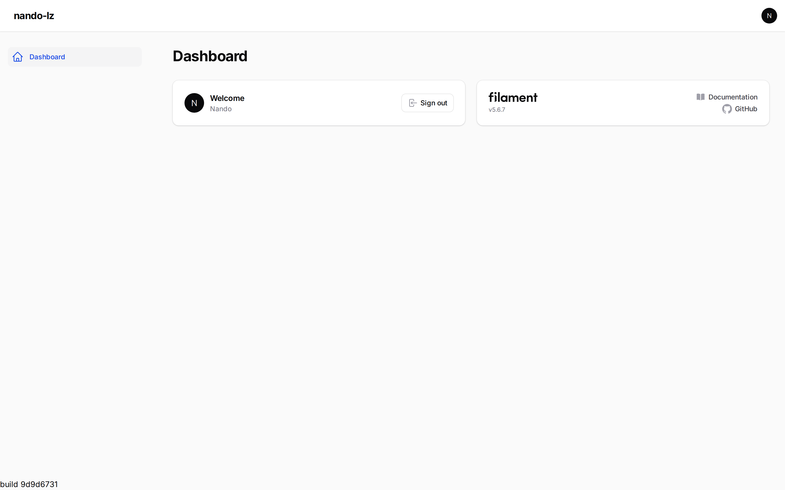
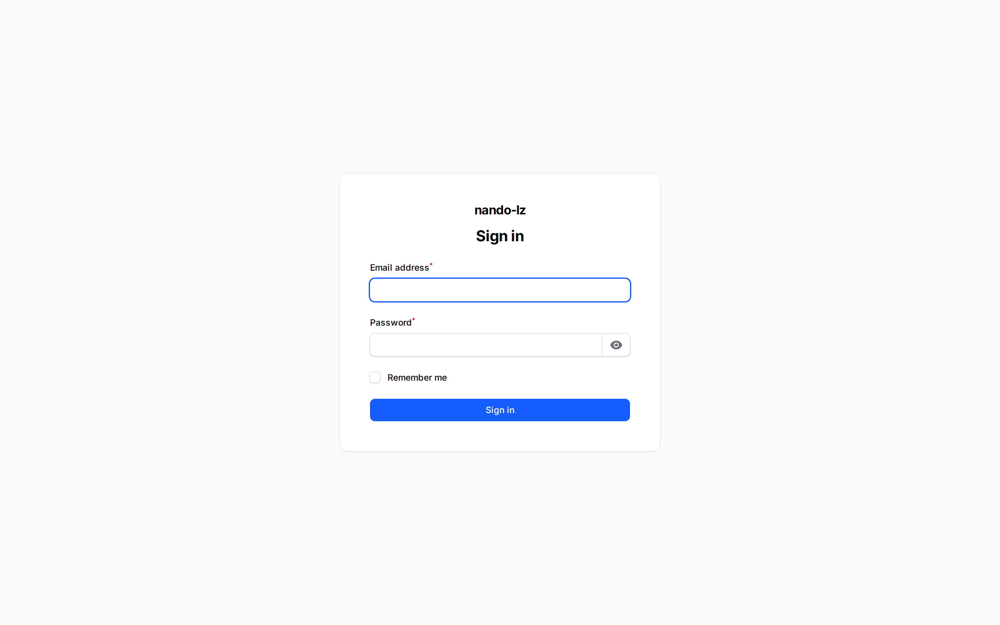
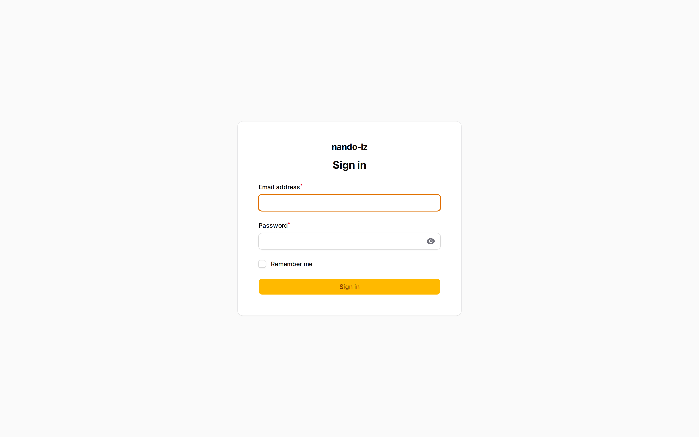
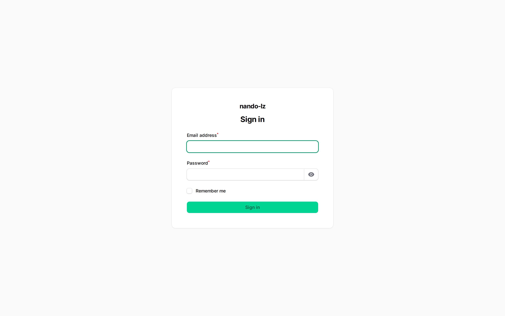
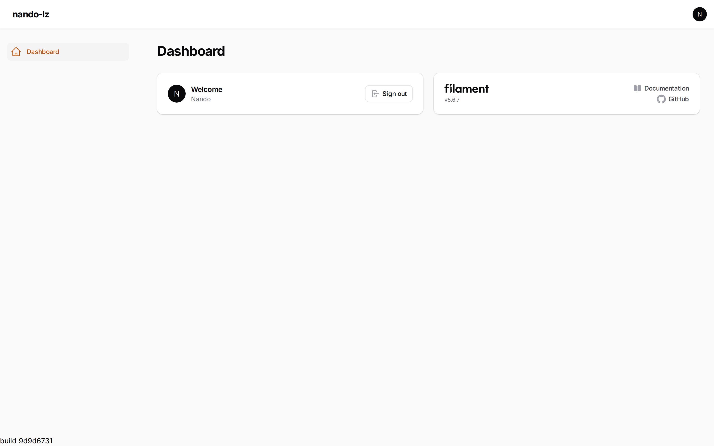
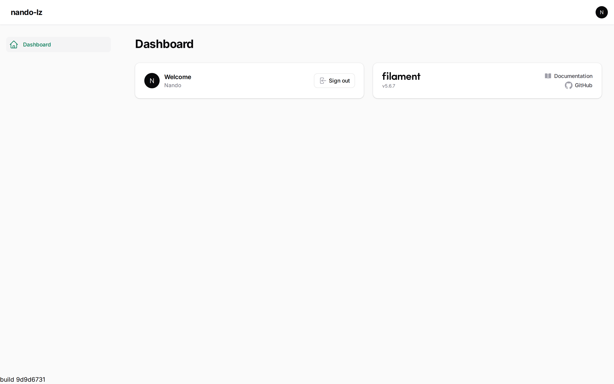
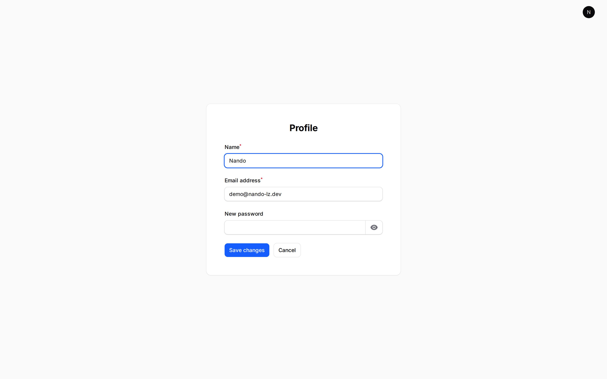
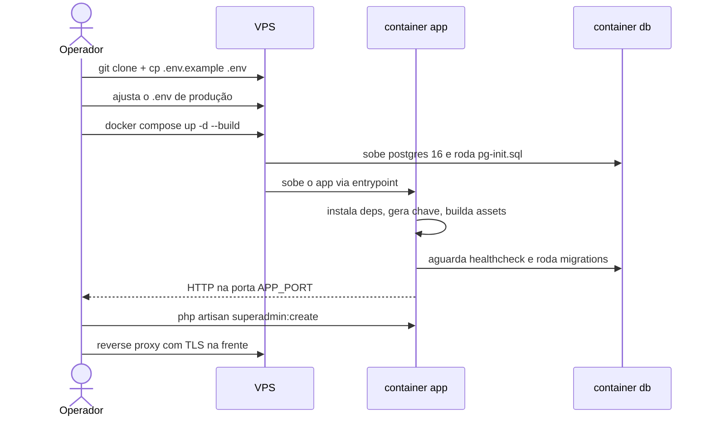
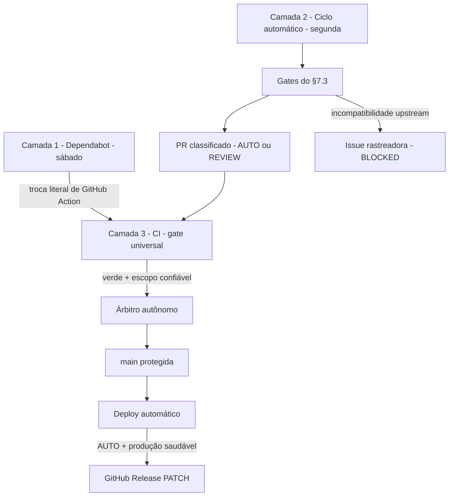

# nando-lz

[](https://github.com/nandinhos/nando-lz/actions/workflows/ci.yml)
[](https://github.com/nandinhos/nando-lz/actions/workflows/auto-update.yml)

<!-- stack:badges:start -->


<!-- stack:badges:end -->


<p align="center">
  
</p>

Starter kit técnico **público** e _evergreen_ para novos projetos **Laravel + Filament**: limpo, genérico, reproduzível e **permanentemente atualizado por automação**. Clone, rode um único script e tenha, em minutos, uma aplicação funcional na última versão estável e mutuamente compatível de toda a stack.

> **É uma fundação técnica, não um produto.** A landing do starter existe apenas para divulgar e monitorar a base técnica; não há SaaS, checkout, pagamento, convite, multitenancy nem qualquer regra de negócio. Só estrutura conhecida-boa para você construir por cima.

---

## Sumário

- [Por que existe](#por-que-existe)
- [O que já vem pronto](#o-que-já-vem-pronto)
- [Pré-requisitos](#pré-requisitos)
- [Início rápido](#início-rápido)
- [Stack](#stack)
- [Os 3 painéis Filament](#os-3-painéis-filament)
- [Autenticação e primeiro admin](#autenticação-e-primeiro-admin)
- [Identificador de build](#identificador-de-build)
- [Estrutura do repositório](#estrutura-do-repositório)
- [Scripts](#scripts)
- [Testes](#testes)
- [Deploy na VPS](#deploy-na-vps)
- [Automação de manutenção](#automação-de-manutenção)
- [Versionamento e releases](#versionamento-e-releases)
- [Documentação](#documentação)
- [Restrições do projeto](#restrições-do-projeto)
- [Licença](#licença)

---

## Por que existe

Manter um projeto Laravel + Filament sempre atualizado é trabalhoso: as versões precisam ser **mutuamente compatíveis**, e o Filament costuma ser o pacote que limita qual major do Laravel se pode usar. O `nando-lz` resolve isso de duas formas:

1. **Base conhecida-boa** — um estado sempre estável, testado e taggeado (SemVer), do qual qualquer projeto novo pode partir.
2. **Automação em três camadas** — Dependabot para referências de GitHub Actions, ciclo controlado para dependências e CI/árbitro para evidências independentes mantêm a stack atualizada sem merge cego. Ver [automação](#automação-de-manutenção).

---

## O que já vem pronto

- ✅ **Laravel 13** na última estável suportada pelo Filament.
- ✅ **Filament 5** com **três painéis**: `ops`, `admin`, `support` (cada um com tema próprio).
- ✅ **Autenticação** oficial do Filament, **sem registro público**, com página de perfil e **2FA opcional** (opt-in).
- ✅ **`POST /logout`** nativo (nunca GET) — encerra a sessão, invalida-a e regenera o token CSRF.
- ✅ Comando **`superadmin:create`** para o primeiro administrador, com guarda de duplicidade e senha forte.
- ✅ **Pest** com suíte de sanidade (**30 testes, ~103 asserts**) sobre **PostgreSQL** — inclui login por credenciais válidas/inválidas na página do Filament.
- ✅ **Dois modos de instalação idempotentes**: Local e Docker, ambos por um único script.
- ✅ **Docker não-root**: o container roda como usuário `app` com UID do host — nada de arquivos root-owned no bind-mount.
- ✅ **Banco de teste isolado no Docker** (`nando_lz_testing`, criado por `docker/pg-init.sql`) — `php artisan test` no container nunca toca o banco de dev.
- ✅ **Identificador de build** no rodapé da sidebar de todos os painéis.
- ✅ **Resolvedor de compatibilidade** (`resolve-stack.sh`) e **ciclo de atualização** (`update-stack.sh`).
- ✅ **CI/CD**: workflows `ci`, `auto-update`, `autonomous-merge`, `compat-watch` e Deploy production + configuração do Dependabot.
- ✅ **Documentação** para humanos e para agentes de IA, e relatórios versionados de cada ciclo.

---

## Pré-requisitos

**Modo Local:** PHP `>= 8.3` com `ext-intl`, Composer, Node 22, PostgreSQL 16. O `check-requirements.sh` valida a **versão do PHP** (≥ 8.3.0), a extensão `ext-intl`, a **presença** de `composer`, `node` e `psql` (sem checar a versão destes) e as permissões de escrita em `storage`/`bootstrap/cache`.

**Modo Docker:** apenas Docker + `docker compose` (v2). Não exige PHP nem PostgreSQL na máquina.

---

## Início rápido

```bash
git clone https://github.com/nandinhos/nando-lz.git
cd nando-lz
./scripts/install.sh        # menu: 1) Local  2) Docker
```

O instalador é interativo e também aceita o modo direto: `./scripts/install.sh local` ou `./scripts/install.sh docker`.

**Comandos do dia a dia:**

| Ação              | Local                           | Docker                                                  |
| ----------------- | ------------------------------- | ------------------------------------------------------- |
| Subir a aplicação | `php artisan serve`             | `docker compose up -d`                                  |
| Migrations        | `php artisan migrate`           | `docker compose exec app php artisan migrate`           |
| Testes            | `php artisan test`              | `docker compose exec app php artisan test`              |
| Primeiro admin    | `php artisan superadmin:create` | `docker compose exec app php artisan superadmin:create` |
| Assets (HMR)      | `npm run dev`                   | —                                                       |

No modo Docker a porta pública é **alta por padrão** (`18000`) para evitar conflitos — acesse `http://localhost:18000`. No modo Local, `php artisan serve` usa `http://127.0.0.1:8000`.

> [!NOTE]
> No Docker, os testes rodam contra o banco dedicado `nando_lz_testing` (definido nos `<env>` do `phpunit.xml` e criado por `docker/pg-init.sql`) — o comando `docker compose exec app php artisan test` é seguro e nunca toca o banco de desenvolvimento. Ver [docs/DOCKER.md](docs/DOCKER.md).

### Personalizar o projeto (rebrand)

Clonou para começar algo seu? O `install.sh` oferece o **wizard de personalização**, ou rode direto:

```bash
php artisan app:setup
```

Um wizard de terminal (Laravel Prompts) pergunta o **nome da aplicação**, o **banco**, se já existe **URL do repositório** e a **porta pública**, e reescreve toda a identidade do projeto de uma vez. O **pacote Composer** (`vendor/nome`) é derivado automaticamente do nome da aplicação — você não precisa informar, e `--package` fica disponível apenas como override avançado. Se você ainda não tiver repositório remoto, pode continuar e definir o `APP_GITHUB_URL` depois. Ele também **desanexa a automação do starter** silenciosamente, deixando só o CI para os seus testes.

- **Preview antes de aplicar:** `php artisan app:setup --preview` mostra exatamente o que mudaria, sem tocar em nada.
- **Reversível:** por padrão as mudanças ficam no working tree — desfaça tudo com `git restore .`. O reset do histórico é opt-in e avisado.
- **Porta sem conflito:** detecta o que está ativo (banco, sistema, outros serviços) e sugere uma **porta alta livre** para o `APP_PORT`.
- **Reaplicar:** `--force` ignora a guarda de "já personalizado" — útil se você quer rodar o wizard novamente para ajustar algo.
- **Welcome operacional:** depois do rebrand, a rota `/` deixa de ser a landing do starter e passa a mostrar uma página inicial do projeto, com links para `/ops`, `/admin` e `/support`.
- **Scripts do starter preservados:** `scripts/install*.sh`, `scripts/bootstrap-app.sh`, etc. são **ferramentas do starter** e não são reescritos pelo `app:setup` — continuam funcionando para re-installs e detecção do estado "personalizado" via `grep "name": "nandinhos/nando-lz"` no `composer.json`.

Detalhes em [docs/MAINTAINER.md](docs/MAINTAINER.md).

---

## Stack

Travada e verificada em 2026-07-01. **O Filament é o pacote limitante:** a major do Laravel é derivada do que o Filament estável suporta — nunca escolhida isoladamente.

<!-- stack:table:start -->
| Componente | Versão | Observação |
|-----------|--------|------------|
| Laravel | 13.29.0 | major derivada do Filament |
| Filament | 5.7.7 | pacote limitante |
| Livewire | 4.4.3 | transitivo via Filament — **nunca fixar direto** |
| Pest | 4.7.8 | framework único de testes |
| PHP | `^8.3` | piso; validado em 8.3 e 8.4 no CI (o Docker usa 8.4) |
| PostgreSQL | 16 | banco padrão; pgvector opcional |
| Node | 22 | build de assets |
<!-- stack:table:end -->

O `composer.json` fixa `config.platform.php = 8.3.0`, garantindo que o lock resolvido seja sempre válido no piso da constraint. Versões instáveis (`alpha`/`beta`/`RC`/`dev`/`nightly`) são **proibidas sem autorização humana em issue**. A resolução completa (ordem §4.1, janela de incompatibilidade §4.2) está em [docs/STACK.md](docs/STACK.md) e é implementada por [`scripts/resolve-stack.sh`](scripts/resolve-stack.sh), que emite um JSON com a stack atual, o alvo e um flag `blocked_upstream`.

---

## Os 3 painéis Filament

Apenas estrutura inicial, sem domínio de negócio. Cada painel tem login (sem registro público), página de perfil e 2FA opcional, e exibe o identificador de build no rodapé da sidebar.

| Painel    | Rota       | Tema    | Propósito futuro                     |
| --------- | ---------- | ------- | ------------------------------------ |
| `ops`     | `/ops`     | Blue    | Administração global                 |
| `admin`   | `/admin`   | Amber   | Aplicação principal (painel default) |
| `support` | `/support` | Emerald | Suporte e manutenção                 |

|                                  `/ops/login` — Blue                                   |                                   `/admin/login` — Amber                                    |                                    `/support/login` — Emerald                                     |
| :------------------------------------------------------------------------------------: | :-----------------------------------------------------------------------------------------: | :-----------------------------------------------------------------------------------------------: |
|  |  |  |

<details>
<summary><strong>Mais screenshots</strong> — dashboards admin/support e página de perfil</summary>

|                                        `/admin`                                         |                                         `/support`                                          |
| :-------------------------------------------------------------------------------------: | :-----------------------------------------------------------------------------------------: |
|  |  |

|                   Página de perfil (com seção de 2FA opcional)                    |
| :-------------------------------------------------------------------------------: |
|  |

</details>

Todo usuário autenticado acessa os três painéis — `User::canAccessPanel()` retorna `true`, pois não há papéis nem permissões. **É aqui que você restringe o acesso ao introduzir regra de negócio.**

---

## Autenticação e primeiro admin

Autenticação oficial do Filament, **sem página pública de registro**. O logout é sempre `POST /{painel}/logout` (GET retorna **HTTP 405** — proteção CSRF) e, nativamente, encerra a sessão, invalida-a e regenera o token CSRF.

O primeiro administrador é criado por comando:

```bash
php artisan superadmin:create
```

- **Bootstrap único:** só roda enquanto não existir nenhum usuário; os demais são criados pelo painel.
- **Interativo por padrão.** Os argumentos `--name --email --password` só são aceitos em `local`/`dev`.
- **`email_verified_at` atribuído explicitamente** (fica fora do `$fillable` por design — mass assignment o descartaria).

> [!IMPORTANT]
> Fora de `local`, a senha forte é obrigatória: mínimo 12 caracteres com maiúsculas, minúsculas, números e símbolos — senhas triviais são recusadas. Em `local`, o mínimo é 8.

---

## Identificador de build

Todos os painéis mostram, no rodapé da sidebar, o identificador do build — útil para confirmar visualmente a versão implantada (visível no screenshot no topo deste README). Resolvido por `App\Support\Build::id()` na seguinte precedência:

1. `config('app.build')` (variável de ambiente `APP_BUILD`);
2. arquivo `build.json` na raiz (chave `build`), gerado no build — valores não-escalares são ignorados (proteção contra derrubar os painéis);
3. hash curto do commit Git;
4. `dev`.

---

## Estrutura do repositório

```
app/
  Console/Commands/CreateSuperAdmin.php   Comando superadmin:create
  Models/User.php                         Implementa FilamentUser
  Providers/AppServiceProvider.php        Rodapé de build + paridade serve/Docker
  Providers/Filament/                     OpsPanelProvider, AdminPanelProvider, SupportPanelProvider
  Support/Build.php                       Resolução do identificador de build (§5.6)
docker/
  entrypoint.sh                           Bootstrap idempotente do modo Docker
  pg-init.sql                             Cria o banco de teste na 1ª inicialização do volume
scripts/                                  Instalação e manutenção (ver abaixo) — preservados pelo app:setup
tests/Feature/SanityTest.php              Suíte Pest de sanidade (30 testes, state-aware)
docs/                                     Documentação + docs/reports/auto-update/ (relatórios de ciclo)
.github/workflows/                        ci.yml · auto-update.yml · autonomous-merge.yml · compat-watch.yml · deploy-production.yml
Dockerfile · docker-compose.yml           Modo Docker (container não-root, restart: unless-stopped)
.dockerignore                             Contexto de build reduzido a poucos KB
.github/dependabot.yml                    Camada 1 da automação
.env.example                              PostgreSQL por padrão
```

---

## Scripts

Todos em `scripts/`, **idempotentes** e sem `git push` embutido. Todos usam `set -euo pipefail` — exceto `update-stack.sh`, que dispensa o `-e` **de propósito** para coletar falhas de todos os gates e ainda gerar o relatório do ciclo.

| Script                  | Função                                                                                                                                                 |
| ----------------------- | ------------------------------------------------------------------------------------------------------------------------------------------------------ |
| `install.sh`            | Entrada única — menu `1) Local  2) Docker`                                                                                                             |
| `install-local.sh`      | Instalação Local (sem Docker)                                                                                                                          |
| `install-docker.sh`     | Instalação via Docker (sem PHP/PostgreSQL locais); espera até 5 min no primeiro boot; mensagem final com URL clicável (OSC 8) e fallback em texto puro |
| `check-requirements.sh` | Valida versão do PHP, `ext-intl`, presença de Composer/Node/psql e permissões (exit codes 10–15)                                                       |
| `bootstrap-app.sh`      | `.env`, chave, migrations e build — idempotente (`--no-build`, respeita `ARTISAN`)                                                                     |
| `reset-app.sh`          | Recria o banco limpo (destrutivo; `--force`)                                                                                                           |
| `test-app.sh`           | Roda o Pest                                                                                                                                            |
| `resolve-stack.sh`      | Resolvedor de compatibilidade (§4.1), saída JSON, timeouts de rede explícitos                                                                          |
| `update-stack.sh`       | Ciclo do agente (§7): gates + relatório (`--dry-run`); **não faz push**                                                                                |

---

## Testes

Suíte Pest de sanidade sobre PostgreSQL — **30 testes, ~103 asserts** — no banco de teste `nando_lz_testing` (via `RefreshDatabase`):

```bash
php artisan test                              # Local (ou ./vendor/bin/pest)
docker compose exec app php artisan test     # Docker — isolado, seguro
```

Valida: a aplicação sobe; a rota inicial responde; login de cada painel; **autenticação por credenciais válidas e rejeição de inválidas na página de login do Filament** (`Livewire::test` + `fillForm`); painéis exigem autenticação; usuário autenticado acessa cada painel e vê o build no rodapé; logout não é GET (405); `POST /logout` encerra a sessão e regenera o CSRF; `superadmin:create` cria/recusa-trivial/bloqueia-duplicidade — o teste de senha usa `password123`, que passa na regra fraca de `local` mas falha na regra forte, distinguindo as duas de verdade; migrations em banco limpo; README bate exato com a stack instalada (guarda de drift); `app:setup` permite continuar sem repositório remoto; **app:setup não reescreve scripts/** do starter.

**State-aware:** os testes da welcome detectam o estado real do projeto (`config('app.name')`) e aplicam os asserts apropriados:

- **Starter** (`APP_NAME=nando-lz`, rota renderiza `welcome.blade.php`): monitor com data do último ciclo, comando `git remote add origin` quando sem repo.
- **Personalizado** (qualquer outro nome, rota renderiza `project-welcome.blade.php`): apenas os asserts que valem para a welcome operacional.

A suíte passa em ambos os estados — você pode rodar `php artisan test` em um clone virgem e em um projeto pós-`app:setup`, sem mudanças.

---

## Deploy na VPS

O modo Docker é o caminho mais direto e reproduzível para uma VPS. Os serviços `app` e `db` usam `restart: unless-stopped` — a aplicação sobrevive a reboots da VPS.



```bash
git clone https://github.com/nandinhos/nando-lz.git
cd nando-lz
cp .env.example .env
# Ajuste para produção:
#   APP_ENV=production, APP_DEBUG=false, APP_URL=https://seu-dominio
#   APP_PORT= (porta alta livre na VPS, ex.: 18000)
#   DB_PASSWORD= (senha forte)
docker compose up -d --build
docker compose exec app php artisan superadmin:create   # senha forte obrigatória fora de local
```

O `entrypoint` do container faz o bootstrap sozinho (instala dependências, gera a chave se faltar, espera o banco, migra e sobe o servidor) — e retoma corretamente uma instalação interrompida, pois os marcadores de progresso são **arquivos finais** (`vendor/autoload.php`, `node_modules/.package-lock.json`, `public/build/manifest.json`), não diretórios. A aplicação escuta na porta `APP_PORT` (alta por padrão); coloque um **reverse proxy** (Nginx/Caddy/Traefik) na frente para TLS e domínio.

> [!IMPORTANT]
> Em produção: `APP_ENV=production`, `APP_DEBUG=false` e **senha forte** em `DB_PASSWORD` e no superadmin. O `.env` real nunca é versionado.

Notas de produção:

- Defina `APP_BUILD` (ou gere `build.json`) para o rodapé da sidebar refletir a versão implantada.
- `php artisan serve` é simples e funcional; para carga pesada, o upgrade path é php-fpm + Nginx ou Laravel Octane (ver [docs/DOCKER.md](docs/DOCKER.md)).
- Prefira volumes gerenciados para o PostgreSQL (o compose já usa o volume `pgdata`).

### Publicação automática da instância mantida

A instância `nandolz.fssdev.com.br` usa Nginx + PHP-FPM e releases atômicas, não Docker. Depois de um `CI` verde na `main`, o GitHub Actions publica o SHA aprovado por uma chave SSH restrita, exige o health check `/up` e restaura o código anterior se ele falhar. O contrato operacional e a recuperação estão em [docs/DEPLOYMENT.md](docs/DEPLOYMENT.md).

> [!CAUTION]
> `docker compose down -v` **apaga o volume `pgdata` — todo o banco de dados**, incluindo o de teste. Use `docker compose down` (sem `-v`) para parar sem destruir dados.

Detalhes completos em [docs/DOCKER.md](docs/DOCKER.md) e [docs/INSTALLATION.md](docs/INSTALLATION.md).

---

## Automação de manutenção

Manutenção em **três camadas** (nenhuma atualização entra sem os gates verdes):



| Camada                   | Responsável                                           | Papel                                                                                                    |
| ------------------------ | ----------------------------------------------------- | -------------------------------------------------------------------------------------------------------- |
| 1 — Dependabot           | `.github/dependabot.yml`                              | PRs semanais para trocas literais de referências de GitHub Actions                                       |
| 2 — Ciclo automático     | `auto-update.yml`                                     | Ciclo semanal: resolve, atualiza locks, valida e abre PR candidata com relatório                         |
| 3 — CI, árbitro e deploy | `ci.yml` + `autonomous-merge.yml` + branch protection | Exige quatro gates; o árbitro revalida origem/diff e mescla apenas AUTO; o deploy publica a `main` verde |

As mudanças são classificadas em **AUTO** (patch/minor/lock — PR, merge automático só sob condições estritas), **REVIEW** (majors, troca de pacote, mudança estrutural — `needs-human-approval`) e **BLOCKED** (incompatibilidade upstream — sem PR, issue rastreadora). Cada ciclo gera um relatório em `docs/reports/auto-update/`. Detalhes em [docs/AUTO_UPDATE_POLICY.md](docs/AUTO_UPDATE_POLICY.md).

Atualizações fora do escopo AUTO permanecem em `REVIEW` ou `BLOCKED`: não recebem merge automático e produzem a rastreabilidade necessária para tratamento excepcional.

---

## Versionamento e releases

O starter tem **SemVer próprio** (`v1.0.0`, …), independente das versões da stack. Cada atualização autônoma elegível cria automaticamente uma release `PATCH` somente depois de CI, deploy e health check verdes. Marcos `MINOR`/`MAJOR` ou correções excepcionais continuam com tag explícita, mas passam pela mesma prova de produção. Todo release aponta para um estado conhecido-bom; rollback = revert do PR de manutenção + tag de correção. Ver [docs/VERSION_POLICY.md](docs/VERSION_POLICY.md).

---

## Documentação

| Documento                                                | Conteúdo                                                     |
| -------------------------------------------------------- | ------------------------------------------------------------ |
| [docs/INSTALLATION.md](docs/INSTALLATION.md)             | Visão geral dos dois modos                                   |
| [docs/LOCAL.md](docs/LOCAL.md)                           | Modo Local em detalhe                                        |
| [docs/DOCKER.md](docs/DOCKER.md)                         | Modo Docker em detalhe                                       |
| [docs/STACK.md](docs/STACK.md)                           | Stack, resolução de compatibilidade, build id, pgvector, 2FA |
| [docs/VERSION_POLICY.md](docs/VERSION_POLICY.md)         | Política de versões, SemVer, releases e rollback             |
| [docs/AUTO_UPDATE_POLICY.md](docs/AUTO_UPDATE_POLICY.md) | Automação em 3 camadas, classes, gates                       |
| [docs/TROUBLESHOOTING.md](docs/TROUBLESHOOTING.md)       | Problemas comuns                                             |
| [docs/AI_AGENT_GUIDE.md](docs/AI_AGENT_GUIDE.md)         | Contrato operacional do agente de manutenção                 |
| [docs/MAINTAINER.md](docs/MAINTAINER.md)                 | Papéis mantenedor × usuário, wizard `app:setup`, automação   |
| [docs/images/README.md](docs/images/README.md)           | Convenções para screenshots da documentação                  |
| [CHANGELOG.md](CHANGELOG.md)                             | Histórico de versões                                         |

---

## Restrições do projeto

Este repositório **não** contém regra de negócio e não deve virar produto. Em resumo: nada de SaaS/checkout/pagamento/convite, nada de multitenancy, nada de pacote sem justificativa registrada, nada de versão instável sem autorização em issue, `.env` real nunca versionado, sem logout via GET, e **nenhum merge na `main` sem CI verde**. A lista completa e o contrato do agente estão em [docs/AI_AGENT_GUIDE.md](docs/AI_AGENT_GUIDE.md).

---

## Licença

[MIT](LICENSE).
