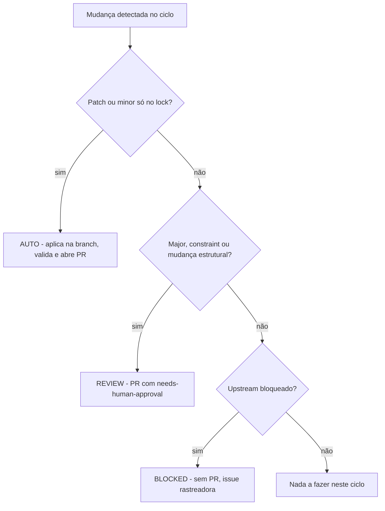

# Política de Auto-Atualização

Como o nando-lz se mantém *evergreen* sem intervenção manual constante — e onde o humano ainda é obrigatório.

## Automação em 3 camadas (§6)

### Camada 1 — Renovate

Arquivo `renovate.json`:

- `rangeStrategy: update-lockfile` — atualiza **só o lock**, preservando as constraints do `composer.json`.
- **Majors desabilitados apenas para composer/npm** (são responsabilidade do agente, Camada 2). **GitHub Actions ficam em grupo próprio, com majors permitidos** — evita ficar preso em actions com runtime Node deprecado.
- Agenda no **sábado** de manhã, timezone `America/Sao_Paulo` — deliberadamente **sem colidir** com o ciclo do agente na segunda.
- Labels `auto-update` e `dependencies`; alertas de vulnerabilidade com label `security`.

> [!WARNING]
> **Requer habilitar o app Renovate no repositório, no GitHub.** Sem isso, o `renovate.json` não tem efeito e o Renovate não abre PRs.

### Camada 2 — Agente de IA

Workflow `auto-update.yml`. **Decide e documenta**, mas **não faz merge**. Roda `scripts/update-stack.sh`, classifica a mudança e abre PR.

### Camada 3 — CI + branch protection

Workflow `ci.yml` é o **gate universal**, complementado por **branch protection na `main`**. Nenhuma mudança entra na `main` sem CI verde.

## Classes de mudança (§7.2)

| Classe | O que é | Ação | Merge |
|--------|---------|------|-------|
| **AUTO** | patch, minor compatível, correção de segurança, lock file, dependência dev, ajuste documental | aplicar na branch, validar, abrir PR | humano até existir decisão aprovada, checks verificados e workflow `auto-merge` reintroduzido |
| **REVIEW** | major de Laravel/Filament/PHP/Livewire; troca/remoção de pacote; mudança estrutural de auth/painéis; base image Docker com breaking change; migração manual | branch + relatório + PR `needs-human-approval` | **exclusivamente humano** |
| **BLOCKED** | incompatibilidade upstream (§4.2) | **sem PR** — issue rastreadora + monitoramento semanal | — |

## Gates obrigatórios (§7.3) — ordem fixa

1. Sincronizar a `main` e criar branch `maintenance/auto-update-YYYY-MM-DD`.
2. `resolve-stack.sh` + classificar.
3. Aplicar só a classe permitida.
4. `composer validate --strict`.
5. `composer audit` (**falha = bloqueio**) e `npm audit --audit-level=high`.
6. Migrations em banco efêmero limpo (serviço PostgreSQL).
7. Suíte Pest completa (30 casos expandidos).
8. Build de assets.
9. Smoke HTTP dos 3 painéis (200/302 autenticado) — coberto pela suíte Pest.
10. Validar `POST /logout`.
11. Gerar o relatório.
12. Commit + abrir PR com o relatório no corpo.
13. **Nunca fazer merge** com qualquer falha/risco ou item REVIEW/BLOCKED.

## Cadência e cron (§7.1)

Workflows em `.github/workflows/`:

- **`ci.yml`** — gate universal. Dispara em push (`main` e `maintenance/**`), `pull_request` e manual. Matriz **PHP 8.3 e 8.4 × PostgreSQL 16** (banco `nando_lz_testing`). Usa `actions/checkout@v7`, `actions/setup-node@v6` e `actions/cache@v6` (cache do Composer por hash do `composer.lock` + versão do PHP da matriz) — sem warnings de runtime Node 20. Passos: `composer validate --strict`, install, `key:generate`, `vendor/bin/pint --test`, `migrate --force`, `npm ci` + `npm run build`, `./vendor/bin/pest`.

- **`auto-update.yml`** — ciclo semanal do agente. Cron `0 11 * * 1` (UTC) = **segunda 08:00 America/Sao_Paulo**; também `workflow_dispatch`. Cria branch `maintenance/auto-update-YYYY-MM-DD`, roda `scripts/update-stack.sh` e **abre PR (nunca faz merge)**. Comportamentos importantes:
  - **Não abre PR se só o relatório mudou** — o relatório sozinho não justifica ciclo de review.
  - Push com `git push --force-with-lease`: um **re-run no mesmo dia** sobrescreve a própria branch com segurança.
  - **Cria o PR ou atualiza o corpo** se ele já existir (re-run do dia).
  - **Bootstrap idempotente de labels** (`auto-update`, `needs-human-approval`, `security`) — funciona em forks/clones novos.
  - Após abrir o PR, dispara `gh workflow run ci.yml --ref <branch>`: pushes feitos com `GITHUB_TOKEN` **não disparam workflows** (regra do GitHub Actions) e, sem esse dispatch, o PR ficaria preso em "Expected" nos required checks. Por isso o workflow tem permissão `actions: write`.
  - Labels: `auto-update` sempre; `needs-human-approval` se o `composer.json` mudou (major/constraint = REVIEW) ou se o ciclo falhou. Falha do ciclo gera issue `maintenance-failure`.
  - O `auto-merge.yml` está suspenso até que a política de checks obrigatórios e autorização de merge automático seja aprovada.

- **`compat-watch.yml`** — vigia a janela de incompatibilidade (§4.2). Semanal. Roda `resolve-stack.sh`; se `blocked_upstream` for verdadeiro, cria/atualiza a issue rastreadora `compat: aguardando Filament x Laravel N` — onde **N é a major aguardada correta**: a última estável do Laravel que o Filament ainda não suporta. Faz bootstrap idempotente do label `blocked-upstream`; quando o upstream liberar, fecha a issue.

## Relatórios (§9)

Cada ciclo gera `docs/reports/auto-update/YYYY-MM-DD.md` com:

- data;
- matriz de versões antes → depois;
- dependências atualizadas / mantidas;
- classificação (§7.2);
- comandos executados;
- resultado de testes / audits / smoke;
- falhas / riscos;
- próximos passos;
- hash do commit;
- link do PR.

Já existe um primeiro relatório de exemplo em `docs/reports/auto-update/`.

O script `update-stack.sh [--dry-run]` gera o relatório **mesmo em falha** (exit `1`); com `--dry-run` não altera locks. Por isso ele usa `set -uo pipefail` **sem o `-e`, de propósito**: cada gate que falha é coletado e o relatório sai completo mesmo assim. Ele **nunca** cria branch, commita ou faz push — isso é responsabilidade do workflow.

## Documentação sempre exata (guarda de drift)

As versões exibidas **têm que bater exato** com a stack instalada, em três lugares:

- **Landing + monitor** (`welcome`): leem do `composer.lock`/runtime via `App\Support\Stack` — exatos por construção, sem número hardcoded.
- **README**: badges e tabela de stack ficam entre marcadores `<!-- stack:… -->` e são gerados a partir da fonte única (`composer.lock`, `composer.json`, `docker-compose.yml`, `ci.yml`) por `php artisan stack:sync`.

Dois mecanismos garantem que nunca divirja:

1. **Fluxo de update** — `update-stack.sh` roda `stack:sync` a cada ciclo, então todo bump de versão já atualiza o README.
2. **Gate no CI** — um teste Pest roda `stack:sync --check` e **falha** se o README divergir da stack. Qualquer PR (agente, Renovate ou humano) que mude versões sem sincronizar fica vermelho. Correção: `php artisan stack:sync`.
