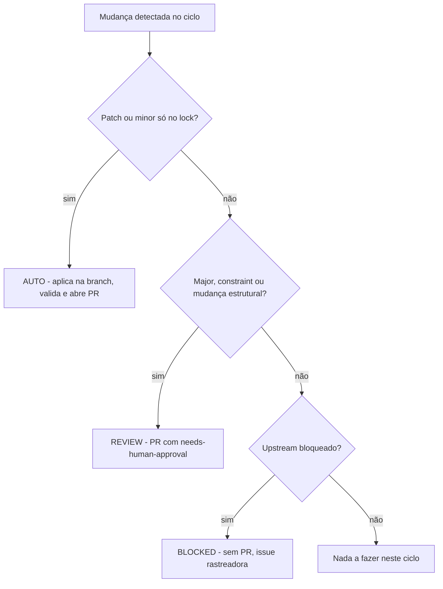

# Política de Auto-Atualização

Como o nando-lz se mantém _evergreen_ sem intervenção manual constante — com autonomia limitada por evidências independentes e falha segura.

## Automação em 3 camadas (§6)

### Camada 1 — Dependabot

Arquivo `.github/dependabot.yml`:

- Atualiza somente as referências de GitHub Actions, em PRs semanais no sábado; Composer/NPM continuam pertencendo ao ciclo controlado da Camada 2.
- A PR recebe `autonomous-candidate`, mas ainda precisa atravessar o árbitro e todos os checks.
- Ações podem receber majors porque a política de diff aceita somente trocas literais de `uses: owner/action@ref`; qualquer edição de lógica YAML bloqueia o merge.

### Camada 2 — Agente de IA

Workflow `auto-update.yml`. Atualiza Composer/NPM dentro das constraints, roda `scripts/update-stack.sh`, gera relatório e abre uma PR candidata apenas quando [scripts/assert-autonomous-update.sh](../scripts/assert-autonomous-update.sh) comprova que o diff contém exclusivamente lock files, README sincronizado e o relatório verde.

### Camada 3 — CI, árbitro, deploy e release

`ci.yml` é o gate universal com PHP 8.3, PHP 8.4 e `Dependency audit`. `autonomous-merge.yml` consome somente metadados e diff pela API, não executa o código de uma PR, reaplica `autonomous-candidate` depois de revalidar o escopo e pede merge por rebase com o SHA da cabeça fixado. A branch protection mantém a `main` fechada até os checks exigidos passarem; `deploy-production.yml` publica automaticamente apenas depois do CI verde na `main`; `publish-release.yml` cria a próxima GitHub Release `PATCH` depois do deploy bem-sucedido.

## Classes de mudança (§7.2)

| Classe      | O que é                                                                                                                                                     | Ação                                                   | Merge                                                                                         |
| ----------- | ----------------------------------------------------------------------------------------------------------------------------------------------------------- | ------------------------------------------------------ | --------------------------------------------------------------------------------------------- |
| **AUTO**    | patch/minor dentro das constraints, lock file, README gerado e relatório do ciclo; ou troca literal de referência de GitHub Action                          | aplicar na branch, validar, abrir PR candidata         | **autônomo** somente se origem confiável, escopo permitido e todos os checks estiverem verdes |
| **REVIEW**  | major de Laravel/Filament/PHP/Livewire; troca/remoção de pacote; mudança estrutural de auth/painéis; base image Docker com breaking change; migração manual | branch + relatório + PR `needs-human-approval`         | **exclusivamente humano**                                                                     |
| **BLOCKED** | incompatibilidade upstream (§4.2)                                                                                                                           | **sem PR** — issue rastreadora + monitoramento semanal | —                                                                                             |

## Gates obrigatórios (§7.3) — ordem fixa

1. Sincronizar a `main` e criar branch `maintenance/auto-update-YYYY-MM-DD`.
2. `resolve-stack.sh` + classificar.
3. Aplicar só a classe permitida.
4. `composer validate --strict`.
5. `composer audit` (**falha = bloqueio**) e `npm audit --audit-level=high`.
6. Migrations em banco efêmero limpo (serviço PostgreSQL).
7. Suíte Pest completa.
8. Build de assets.
9. Smoke HTTP dos 3 painéis (200/302 autenticado) — coberto pela suíte Pest.
10. Validar `POST /logout`.
11. Gerar o relatório.
12. Commit + abrir PR com o relatório no corpo.
13. O árbitro pede merge por rebase somente para AUTO com SHA fixado, `PHP 8.3`, `PHP 8.4`, `Dependency audit` e todos os checks verdes; qualquer falha/risco, item REVIEW ou BLOCKED nunca é mesclado.
14. Depois de CI, deploy e health check de produção concluídos, `publish-release.yml` cria a próxima GitHub Release `PATCH` do candidato marcado como `autonomous-candidate`. A tag aponta para o SHA implantado e não é recriada em reexecuções.

## Cadência e cron (§7.1)

Workflows em `.github/workflows/`:

- **`ci.yml`** — gate universal. Dispara em push (`main` e `maintenance/**`), `pull_request` e manual. Matriz **PHP 8.3 e 8.4 × PostgreSQL 16** (banco `nando_lz_testing`). Usa `actions/checkout@v7`, `actions/setup-node@v7` e `actions/cache@v6` (cache do Composer por hash do `composer.lock` + versão do PHP da matriz). Passos: `composer validate --strict`, install, `key:generate`, `vendor/bin/pint --test`, `migrate --force`, `npm ci` + `npm run build`, `./vendor/bin/pest`.

- **`auto-update.yml`** — ciclo semanal do agente. Cron `0 11 * * 1` (UTC) = **segunda 08:00 America/Sao_Paulo**; também `workflow_dispatch`. Cria branch `maintenance/auto-update-YYYY-MM-DD`, roda `scripts/update-stack.sh` e abre uma PR candidata. Comportamentos importantes:
    - **Não abre PR se só o relatório mudou** — o relatório sozinho não justifica ciclo de review.
    - Push com `git push --force-with-lease`: um **re-run no mesmo dia** sobrescreve a própria branch com segurança.
    - **Cria o PR ou atualiza o corpo** se ele já existir (re-run do dia).
    - **Bootstrap idempotente de labels** (`auto-update`, `dependencies`, `autonomous-candidate`, `needs-human-approval`, `autonomy-blocked` e `security`) — funciona em forks/clones novos.
    - Após abrir o PR, dispara `gh workflow run ci.yml --ref <branch>`: pushes feitos com `GITHUB_TOKEN` **não disparam workflows** (regra do GitHub Actions) e, sem esse dispatch, o PR ficaria preso em "Expected" nos required checks. Por isso o workflow tem permissão `actions: write`.
    - Labels: `autonomous-candidate` somente com diff aprovado e ciclo verde; `needs-human-approval` e `autonomy-blocked` para qualquer desvio. Falha do ciclo gera issue `maintenance-failure`.
    - `autonomous-merge.yml` roda após CI verde, em duas varreduras horárias e manualmente. Ele aceita as identidades oficiais `github-actions[bot]` e `app/github-actions` em branches `maintenance/auto-update-YYYY-MM-DD`, ou `dependabot[bot]` e `app/dependabot` em branches `dependabot/`; revalida o escopo pela API e nunca executa o conteúdo da PR privilegiadamente. Se a branch ficar atrás da `main`, rebaseia, aguarda a publicação do novo SHA e dispara novamente o CI antes de considerar o merge. Para cada gate, só aceita o resultado mais recente concluído com sucesso.

- **`compat-watch.yml`** — vigia a janela de incompatibilidade (§4.2). Semanal. Roda `resolve-stack.sh`; se `blocked_upstream` for verdadeiro, cria/atualiza a issue rastreadora `compat: aguardando Filament x Laravel N` — onde **N é a major aguardada correta**: a última estável do Laravel que o Filament ainda não suporta. Faz bootstrap idempotente do label `blocked-upstream`; quando o upstream liberar, fecha a issue.

## Relatórios (§9)

Cada ciclo gera `docs/reports/auto-update/YYYY-MM-DD.md` com:

- data;
- matriz de versões antes → depois;
- dependências atualizadas / mantidas;
- classificação (§7.2);
- comandos executados;
- resultado de testes / audits / smoke;
- falhas / riscos;
- próximos passos;
- hash do commit;
- link do PR.

Já existe um primeiro relatório de exemplo em `docs/reports/auto-update/`.

O script `update-stack.sh [--dry-run]` gera o relatório **mesmo em falha** (exit `1`); com `--dry-run` não altera locks. Por isso ele usa `set -uo pipefail` **sem o `-e`, de propósito**: cada gate que falha é coletado e o relatório sai completo mesmo assim. Ele **nunca** cria branch, commita, faz push ou merge — isso é responsabilidade dos workflows.

## Documentação sempre exata (guarda de drift)

As versões exibidas **têm que bater exato** com a stack instalada, em três lugares:

- **Landing + monitor** (`welcome`): leem do `composer.lock`/runtime via `App\Support\Stack` — exatos por construção, sem número hardcoded.
- **README**: badges e tabela de stack ficam entre marcadores `<!-- stack:… -->` e são gerados a partir da fonte única (`composer.lock`, `composer.json`, `docker-compose.yml`, `ci.yml`) por `php artisan stack:sync`.

Dois mecanismos garantem que nunca divirja:

1. **Fluxo de update** — `update-stack.sh` roda `stack:sync` a cada ciclo, então todo bump de versão já atualiza o README.
2. **Gate no CI** — um teste Pest roda `stack:sync --check` e **falha** se o README divergir da stack. Qualquer PR (agente, Dependabot ou humano) que mude versões sem sincronizar fica vermelho. Correção: `php artisan stack:sync`.
