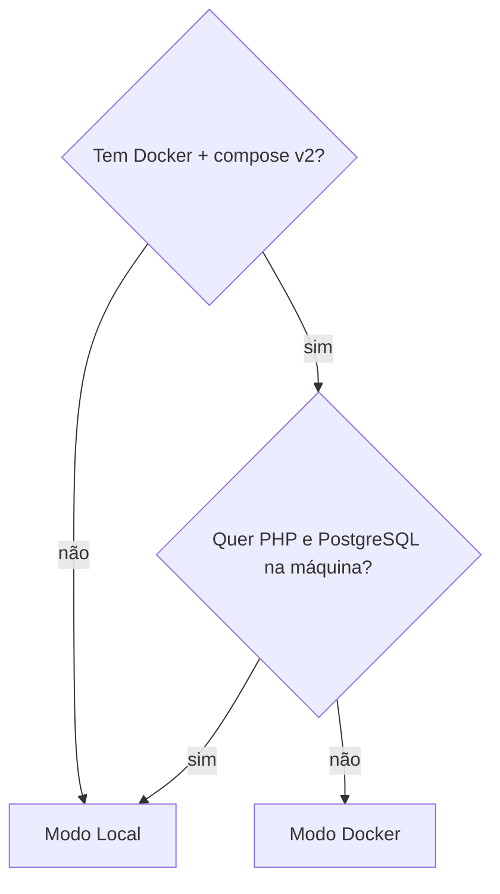

# Instalação

Dois modos de instalação, um único ponto de entrada.

```bash
./scripts/install.sh        # menu: 1) Local  2) Docker
./scripts/install.sh local  # direto no modo Local
./scripts/install.sh docker # direto no modo Docker
```

Todos os scripts são idempotentes, **nenhum faz push** e todos usam `set -euo pipefail` — exceto `update-stack.sh`, que dispensa o `-e` **de propósito** para coletar as falhas de todos os gates e ainda gerar o relatório do ciclo.

## Qual modo escolher



| Modo | Quando usar | Requisitos |
|------|-------------|------------|
| **Local** | Você já tem PHP, Composer, Node e PostgreSQL na máquina | PHP ≥ 8.3, ext-intl, Composer, Node 22, `psql` |
| **Docker** | Você não quer instalar PHP/PostgreSQL localmente | Docker + Docker Compose (v2) |

## Pré-requisitos (modo Local)

Verificados por `scripts/check-requirements.sh`:

- **PHP ≥ 8.3.0** — a versão é checada de fato;
- extensão `ext-intl` (exigida pelo Filament);
- **presença** de Composer, Node e `psql` (a versão destes **não** é checada — recomendados Node 22 e PostgreSQL 16);
- permissões de escrita em `storage` e `bootstrap/cache`.

<details>
<summary><strong>Exit codes do <code>check-requirements.sh</code></strong></summary>

| Código | Significado |
|--------|-------------|
| `0` | Tudo ok |
| `10` | PHP ausente ou versão < 8.3.0 |
| `11` | Extensão `ext-intl` ausente |
| `12` | Composer não encontrado |
| `13` | Node não encontrado |
| `14` | Cliente PostgreSQL (`psql`) não encontrado |
| `15` | Sem permissão de escrita em `storage`/`bootstrap/cache` |

</details>

No modo **Docker** não é preciso PHP nem PostgreSQL locais — só Docker.

## O que cada modo faz

- **Local** (`install-local.sh`): check-requirements → `composer install` → `npm install` → bootstrap → oferece criar o superadmin. Detalhes em [LOCAL.md](LOCAL.md).
- **Docker** (`install-docker.sh`): sobe os containers e **espera o app responder** (até 5 minutos no primeiro boot, que compila vendor + assets); o entrypoint faz o bootstrap. Se o app não responder, o script falha com exit `22` e sugere `docker compose logs -f app`. Detalhes em [DOCKER.md](DOCKER.md).

## Banco de dados

O `.env.example` já vem configurado para PostgreSQL:

```
DB_CONNECTION=pgsql
DB_HOST=127.0.0.1
DB_PORT=5432
DB_DATABASE=nando_lz
DB_USERNAME=postgres
DB_PASSWORD=postgres
```

Os testes usam um banco separado, `nando_lz_testing` (definido em `phpunit.xml`, também pgsql, com `RefreshDatabase`). O `.env` real **nunca** é versionado.

> [!NOTE]
> No modo Docker, o banco de teste é criado automaticamente por `docker/pg-init.sql` na **primeira inicialização** do volume `pgdata`. Em um volume pré-existente, crie-o uma vez: `docker compose exec db psql -U postgres -c 'CREATE DATABASE nando_lz_testing;'`.

## Depois de instalar

Crie o primeiro admin:

```bash
php artisan superadmin:create
```

Ver [LOCAL.md](LOCAL.md) / [DOCKER.md](DOCKER.md) para os comandos completos e [TROUBLESHOOTING.md](TROUBLESHOOTING.md) se algo falhar.
