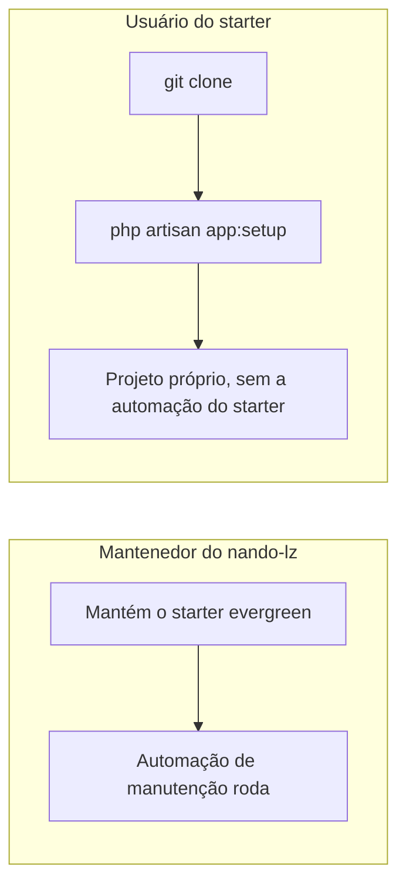

# Guia do mantenedor

Este documento separa dois papéis que compartilham o mesmo repositório.

## Dois papéis



- **Mantenedor** (`nandinhos`, dono de `nando-lz`): mantém a stack sempre atualizada. É dele a **automação de manutenção** — ela existe para manter o _starter_ evergreen, não os projetos derivados.
- **Usuário**: clona o `nando-lz` para começar um projeto novo, roda o wizard `app:setup` (rebrand) e **desanexa** a automação do starter. Fica só com o CI para os testes do próprio projeto.

## Automação de manutenção (só do mantenedor)

Estes artefatos mantêm o **starter** atualizado e **não** fazem sentido num projeto derivado:

| Artefato                                 | Papel                                                                                   |
| ---------------------------------------- | --------------------------------------------------------------------------------------- |
| `.github/workflows/auto-update.yml`      | Ciclo semanal do agente (§7): resolve, aplica patch/minor e abre PR candidata           |
| `.github/workflows/autonomous-merge.yml` | Árbitro sem checkout de PR: revalida autoria, escopo e checks antes do merge por rebase |
| `.github/workflows/compat-watch.yml`     | Vigia a janela de incompatibilidade Filament × Laravel (§4.2)                           |
| `.github/dependabot.yml`                 | Camada 1: PRs de atualização literal de GitHub Actions                                  |
| `scripts/resolve-stack.sh`               | Resolvedor de compatibilidade (§4.1)                                                    |
| `scripts/update-stack.sh`                | Ponto de entrada do ciclo (§7.3)                                                        |

O `ci.yml` **não** é maintenance — é o gate universal de qualquer projeto e sempre permanece.

Detalhes de política em [AUTO_UPDATE_POLICY.md](AUTO_UPDATE_POLICY.md).

## Permissões do Auto Update

Antes de confiar na publicação automática, em `Settings → Actions → General` do repositório:

1. selecione **Read and write permissions** para o `GITHUB_TOKEN`;
2. habilite **Allow GitHub Actions to create and approve pull requests**.

O workflow verifica a segunda opção antes de publicar. Se ela estiver desabilitada, o ciclo preserva o diagnóstico e tenta abrir a issue de falha, mas não afirma que o PR foi criado.

## O wizard `app:setup`

Comando interativo (Laravel Prompts) que transforma um clone em projeto próprio. O `install.sh` o oferece automaticamente num clone ainda não personalizado.

```bash
php artisan app:setup            # interativo
php artisan app:setup --preview  # mostra o plano e não altera nada
# não-interativo (CI/scripts):
php artisan app:setup --name="Acme CRM" --db="acme_crm" \
  --url="https://github.com/acme/crm" --port=18000 --no-interaction
# sem repositório remoto ainda:
php artisan app:setup --name="Acme CRM" --db="acme_crm" \
  --url= --port=18000 --no-interaction
```

O que faz:

1. **Preview** — sem `--preview`, o wizard ainda mostra o plano (arquivos a reescrever, arquivos a remover, porta, git) e pede confirmação antes de aplicar. Com `--preview`, só mostra e sai.
2. **Rebrand** — reescreve identidade em todo o projeto: `APP_NAME`, pacote Composer derivado automaticamente do nome da aplicação, banco de dados (e o banco de teste `*_testing`), URL do repositório quando houver, títulos e referências. Se o repositório remoto ainda não existir, o wizard permite continuar e deixa `APP_GITHUB_URL` vazio para preenchimento posterior. Depois do rebrand, `/` mostra a welcome operacional do projeto, não a landing de divulgação do starter.
3. **Porta sem conflito** — detecta portas ativas (banco, sistema, outros serviços) via bind de socket e sugere uma **porta alta livre** para o `APP_PORT`. O `install-docker.sh` faz a mesma checagem antes do `up`.
4. **Automação silenciosa** — remove a automação do starter e mantém só o CI do projeto derivado. Não há escolha de Dependabot/mantenedor no onboarding.
5. **Reset git** (opcional, **opt-in**) — recomeça o histórico com um commit inicial. Por padrão o wizard **não** reseta: as mudanças ficam no working tree e são reversíveis com `git restore .`.
6. **Re-hash do lock** — roda `composer update --lock` para o `composer validate --strict` do CI seguir verde após a troca de nome do pacote.

> [!TIP]
> Fluxo reversível recomendado: `app:setup --preview` → `app:setup` (aplica no working tree) → revise com `git diff` → se algo estiver errado, `git restore .` desfaz tudo; se estiver bom, comite (ou rode de novo com `--reset-git` para um histórico limpo).

> [!NOTE]
> O `app:setup` é de uso único: após rodar, o `composer.json` deixa de se chamar `nandinhos/nando-lz` e o próprio comando passa a se recusar a rodar de novo (use `--force` para forçar). Pode remover `app/Console/Commands/SetupProject.php` depois.

## Fluxo do mantenedor (manter o starter)

1. O ciclo `auto-update.yml` roda toda segunda 08:00 (America/Sao_Paulo), e o Dependabot confere Actions aos sábados.
2. Atualizações AUTO só prosseguem quando os gates locais, o CI e o árbitro de escopo estiverem verdes; o merge por rebase e o deploy ocorrem sem revisão humana.
3. Alterações de major, manifest, código, migration ou qualquer escopo não previsto são bloqueadas e registradas para tratamento excepcional.
4. Depois de uma atualização AUTO chegar à produção saudável, `Publish release` cria a próxima release `PATCH` automaticamente. Marcos excepcionais usam o mesmo workflow com tag explícita e nunca ignoram a evidência de deploy; ver [VERSION_POLICY.md](VERSION_POLICY.md).
