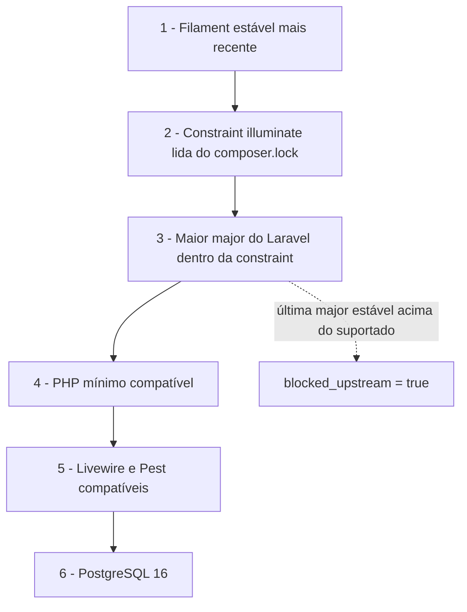
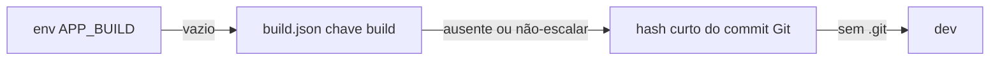

# Stack e Compatibilidade

## Stack de referência (§3)

Travada e verificada. **Filament é o pacote limitante:** a major do Laravel é derivada do que o Filament estável suporta.

| Componente | Versão | Observação |
|-----------|--------|------------|
| Laravel | 13.24.0 | major derivada do Filament |
| Filament | 5.7.6 | pacote limitante |
| Livewire | 4.4.0 | transitivo via Filament — **nunca fixar direto** |
| Pest | 4.7.8 | testes |
| PHP | `^8.3` | piso da constraint; roda em 8.4 (o Docker usa 8.4) |
| PostgreSQL | 16 | |
| Node | 22 | |

O `composer.json` fixa `config.platform.php = 8.3.0`: o Composer resolve o lock como se rodasse no **piso** da constraint, garantindo que o lock seja válido em qualquer PHP ≥ 8.3 — mesmo quando gerado em uma máquina com 8.4.

Versões instáveis (alpha/beta/RC/dev/nightly) são **proibidas sem autorização humana em issue**. Qualquer pré-release do Filament permanece fora do alvo.

## Resolução de compatibilidade (§4)

### Filament limitante

Não se escolhe a major do Laravel de forma independente. Escolhe-se a maior versão estável do Filament e deriva-se dela a stack. Assim o starter nunca fica preso a uma combinação que o Filament ainda não suporta.

### Ordem de resolução (§4.1)

Implementada por `scripts/resolve-stack.sh`:



1. **Filament limitante** — parte da versão estável do Filament.
2. **Constraint `illuminate/*`** lida do `composer.lock` (metadados exatos do pacote instalado).
3. **Maior major suportada do Laravel** dentro dessa constraint.
4. **PHP mínimo** compatível.
5. **Livewire / Pest** compatíveis.
6. **PostgreSQL**.

### Janela de incompatibilidade (§4.2)

Quando sai uma nova major do Laravel mas o Filament estável ainda não a suporta, entra-se numa **janela de incompatibilidade**. Nesse período **não se atualiza** para a major nova — espera-se o upstream. O workflow `compat-watch.yml` vigia essa janela semanalmente e mantém uma issue rastreadora (label `blocked-upstream`) com a **major aguardada** — a última estável do Laravel que o Filament ainda não suporta; quando o Filament liberar, a issue é fechada. Ver `AUTO_UPDATE_POLICY.md`.

## Como o `resolve-stack.sh` funciona

Ponto único de resolução da stack. Consulta a Packagist com timeouts explícitos (`curl --connect-timeout 10 --max-time 60` — um ciclo de automação nunca trava indefinidamente). Saída em **JSON**. Exit codes: `0` ok · `1` erro de rede/parse · `2` PHP indisponível.

Campos do JSON:

- `filament` — versão atual e última estável
- `laravel` — com `illuminate_constraint`, `max_supported_major`, `target_major`
- `livewire`
- `pest`
- `php`
- `postgres`
- `blocked_upstream` — verdadeiro quando há incompatibilidade upstream (§4.2)

<details>
<summary><strong>Exemplo real de saída JSON</strong></summary>

```json
{
    "limiting_package": "filament/filament",
    "filament": {
        "current": "5.7.6",
        "latest_stable": "5.7.6"
    },
    "laravel": {
        "current": "13.24.0",
        "latest_stable": "13.24.0",
        "illuminate_constraint": "^11.28|^12.0|^13.0",
        "max_supported_major": 13,
        "target_major": 13
    },
    "livewire": {
        "current": "4.4.0",
        "note": "transitivo via Filament"
    },
    "pest": {
        "current": "4.7.8"
    },
    "php": {
        "running": "8.4",
        "min": "^8.3"
    },
    "postgres": {
        "min": "16"
    },
    "blocked_upstream": false
}
```

</details>

Esse JSON alimenta a classificação de mudanças (§7.2) e os workflows de automação.

## Identificador de build na sidebar (§5.6)

Todos os painéis exibem o identificador de build no rodapé da sidebar (o texto "build …" é visível no screenshot do painel ops no README). Ele confirma visualmente qual versão está implantada.

Classe: `App\Support\Build::id()`. **Precedência** (o primeiro que resolver vence):



1. `config('app.build')` (env `APP_BUILD`)
2. Arquivo `build.json` na raiz (chave `build`) — valores **não-escalares são ignorados**: um array/objeto em `build` derrubaria os painéis no cast para string
3. Hash curto (8 caracteres) do commit Git — lê `.git/HEAD` diretamente, sem depender do binário `git` em runtime
4. `'dev'`

Registrado uma única vez para todos os painéis via render hook `PanelsRenderHook::SIDEBAR_FOOTER` no `AppServiceProvider`.

## pgvector (opcional)

Não há estrutura multitenant e o pgvector não é usado por padrão.

> [!WARNING]
> A imagem `postgres:16` padrão **não inclui** a extensão pgvector — `CREATE EXTENSION vector;` falha nela. Siga o passo do seu modo antes do `CREATE EXTENSION`.

**Habilitar — modo Docker:** troque a imagem do serviço `db` no `docker-compose.yml` (drop-in, mesma major do PostgreSQL):

```yaml
  db:
    image: pgvector/pgvector:pg16   # antes: postgres:16
```

Recrie o container (`docker compose up -d db`) e então:

```bash
docker compose exec db psql -U postgres -d nando_lz -c 'CREATE EXTENSION IF NOT EXISTS vector;'
```

**Habilitar — modo Local:** instale o pacote da distro antes do `CREATE EXTENSION`:

```bash
sudo apt install postgresql-16-pgvector   # Debian/Ubuntu; ajuste à sua distro
psql -U postgres -d nando_lz -c 'CREATE EXTENSION IF NOT EXISTS vector;'
```

**Casos de uso:** embeddings / busca semântica, com uma coluna do tipo `vector`.

**Desabilitar:**

```sql
DROP EXTENSION vector;
```

## 2FA opcional (app autenticador)

Desabilitado por padrão — é **opt-in**. Para habilitar em um painel:

1. Descomente, no PanelProvider desejado, a linha:
   ```php
   ->multiFactorAuthentication(\Filament\Auth\MultiFactor\App\AppAuthentication::make())
   ```
2. Faça o model `User` implementar o contrato `Filament\Auth\MultiFactor\App\Contracts\HasAppAuthentication`.
3. Adicione as colunas necessárias via migration.

## Autenticação (contexto)

Autenticação oficial do Filament. O model `User` implementa `Filament\Models\Contracts\FilamentUser` com `canAccessPanel()` retornando `true` — todo usuário autenticado acessa todos os painéis. **Não há papéis nem permissões**; restrinja aqui ao introduzir regra de negócio. Sem página pública de registro. Logout é `POST /{painel}/logout` (nativo do Filament; encerra a sessão, invalida-a e regenera o token CSRF). Logout via GET não existe (HTTP 405). O fluxo de login é coberto por testes com credenciais válidas e inválidas (`Livewire::test` na página de login do Filament).
